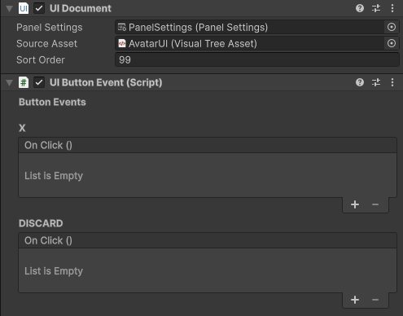

### UI Toolkit Button events adds the classic UnityEvent events back to the buttons.

How to use:
Add the component to your UIDocument Gameobject.
The Component automatically grabs your buttons from your UIDocument.

